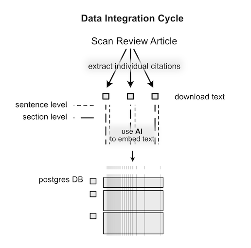
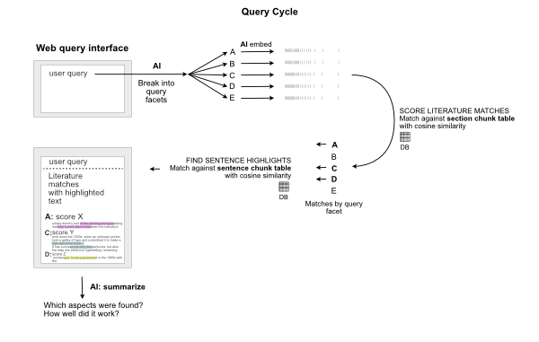

# Knowledge Synthesis with AI

**Objectives:**

* Develop a knowledge base from open access veterinary and medical literature focused on diagnosis with NGS techniques
* Look for commonalities and gaps in knowledge between the domains
* Benefits: 
  * control source information (bypass hallucination)
  * privatize searches (if local AI)
  * fine-grain information retrieval (highlight source text)

> *Sample prompt:* "How does NGS method X in veterinary diagnostics differ in the medical field at the protocol level?"

## Approach

1. Use review article to populate the knowledgebase for each corpus (domain)
  * Medical: Application of metagenomic next-generation sequencing in the diagnosis of infectious diseases. *Front. Cell. Infect. Microbiol., 14 November 2024*
  * Veterinary: Application of Next-Generation Sequencing (NGS) Techniques for Selected Companion Animals. *Animals 2024, 14(11), 1578;*
  * Extract full text from open access articles cited.
2. Ingest literature: divide into chunks and embed (converts language to vector)
3. Query database and interpret results
4. Analyze performance using lessons from Seurat scRNA-seq workflow

###  Data Integration cycle

This is a matter of getting the text, dividing it into digestable chunks (intro, results, methods, discussion), and embedding it. This step translates the text into the model and is accomplished via API calls to openAI. 

### Query Cycle

Following the idea of Retrieval Augmented Generation (RAG), the query model takes the user query as a prompt, like a chatBot. My approach differs in that it queries AI to dissect the query into *facets* first.  The benefit is that the user's prompt may comprise different types of information which may be spread across difference sections of a paper.

Another addition to the standard approach is my embedding at two levels of granuarity. If a query facet matches a paper section, then a secondary database search is done at the sentence level to find "source text" underlying the match at the broader level.

## Analysis of Knowledge Synthesis

The performance of the query engine and knowledge synthesis are two different aspects. To understand the performance of knowledge synethesis, adequate knowledge must be represented in the database. First I will summarize the knowledge base by clustering the embeddings. Second, I will discuss the effectiveness of the queries.

### 1. Clustering the embeddings

For this I applied clustering and dimension reduction used by the Seurat approach to find cell-types in single cell RNA-seq analysis.
Since each embedded chunk is translated to a vector in the AI model's reduced space, I can use those vectors in place of a single cell transcriptome.

Chunks (cells) are clustered in the principle components space with louvain clustering, visualized via UMAP, and analyzed for representative terms.

#### Cluster breakdown

| cluster_id | size | medical_count | vet_count | med_vet_ratio | label | top_terms |
| ---        | ---  | ---           | ---       | ---           | ---   | ---       |
| 1 | 362 |359 | 3 | 119.67 |mngs_culture_pathogens |"mngs, culture, pathogens, positive, results, infection, detection, samples, al, et" |
|2|332|324|8|40.5|csf_mngs_infection|"csf, mngs, infection, diagnosis, encephalitis, al, et al, et, cns, detection"|
|3|215|129|86|1.5|sequencing_reads_sequences|"sequencing, reads, sequences, samples, pcr, library, kit, μl, sequence, libraries"|
|4|227|147|80|1.8375|email_acknowledgments_thank|"email, acknowledgments, thank, com, edu, grant, authors, contributor, conflicts, test"|
|5|53|53|0|53.0|deeplex_resistance_myc tb|"deeplex, resistance, myc tb, deeplex myc, myc, tb, drug, pfmdr1, sequencing, samples"|
|6|253|38|215|0.176|sequencing_ngs_reads|"sequencing, ngs, reads, read, genome, minion, nanopore, sequence, long, base"|
|7|198|118|80|1.475|sequencing_ngs_microbial|"sequencing, ngs, microbial, mngs, genome, reads, samples, metagenomic, microbiome, species"|
|8|99|76|23|3.304|antibiotic_shock_septic|"antibiotic, shock, septic, septic shock, therapy, sepsis, antibiotics, icu, resistant, infections"|
|9|55|34|21|1.619|consent_ethics approval_ethics|"consent, ethics approval, ethics, informed consent, informed, participate, approval, committee, statement, ethics committee"|
|10|87|87|0|87.0|hct_recipients_cell|"hct, recipients, cell, infection, donor, infections, scidh, cells, transplant, rejection"|
|11|186|13|173|0.075|dogs_cov_dog|"dogs, cov, dog, sars cov, al, et al, et, sars, samples, sequences"|
|12|98|97|1|97.0|uti_urine_mngs|"uti, urine, mngs, urinary, pili, culture, ruti, utis, urinary tract, et al"|
|13|193|138|55|2.509|culture_pcr_pji|"culture, pcr, pji, blood culture, diagnostic, pathogens, results, positive, detection, time"|

#### Interpretation

Clusters above show diffent aspects of literature. Some represent undesired information, such as procedural aspects of publication (acknowledgements, author contributinos), and ethics approval. Other clusters however, capture NGS method, pathogen of interest, and information  about the method.  Some descriptors, such as "et al", are an artifact of the term summary approach (IDF versus AI).

An interesting result is the imbalance between veterinary and medical papers in the clusters. Conceptually, this suggests that language in the paper sections includes enough domain-specific terminology that they do not generalize between the two, except in sections that are procedural or methodological.

Although this result is understandable, it indicates another layer necessary to find gaps in knowledge between the fields.

### 2. Query performance

The best working queries are not at the level of the eventual goal, i.e., to find gaps and similarities. However, they are adept at extracting specific information.

**Example Strong Query:** What is the sensitivity of mNGS for bacterial meningitis in CSF?

Subqueries identified by aspect:

* [METHODOLOGY] What is the methodology used for diagnosing bacterial meningitis with NGS?
* [TARGET] What pathogens are associated with bacterial meningitis?
* [SAMPLE] What type of specimen is used for diagnosing bacterial meningitis?
* [PERFORMANCE] What is the sensitivity of mNGS for detecting bacterial meningitis?

Best hit: PERFORMANCE

Excerpt with highlight: 

When SSRNs ≥5 or 10 were considered positive, the AUC (0.758, 95% CI = 0.663–0.854) was largest. **The sensitivity, specificity, positive predictive value, and negative predictive value of mNGS in the diagnosis of 15 patients with definite bacterial meningitis were 73.3, 95.9, 61.1, and 97.6%, respectively ( Table S3 ) and the AUC was largest (0.846, 95% CI = 0.711–0.981).** In brief, among the 43 patients with presumed bacterial meningitis (15 definite and 28 probable), mNGS identified a bacterial pathogen in 24 (55.8%, 24/43); conversely, the CSF combined Gram stain/culture-positive rate was only 32.56% (14/43).

**Example Weak Query:** How does mNGS detect viral infections in CSF?

Subqueries identified by aspect:

* [METHODOLOGY] What is the methodology of mNGS for detecting viral infections?
* [TARGET] What types of viral infections can mNGS detect?
* [SAMPLE] What is the significance of using CSF as a sample type for mNGS?

Best hit: METHODOLOGY

Excerpt with highlight: 

In addition, it can be used to dynamically monitor disease progression by analysing semi-quantitative values ( Zhang et al., 2020b ). **However, mNGS has some shortcomings in diagnosing CNS. While it frequently detects DNA viruses, particularly herpesviruses, its ability to enhance the diagnosis of viral encephalitis and meningitis has not shown significant improvement.** One possible reason for this limitation is the underrepresentation of RNA detection methods in current mNGS protocols ( Guan et al., 2016 ; Tyler, 2018 ; Xia et al., 2019 ; Fang et al., 2020 ).

**Example Strong Query:** What is the turnaround time for mNGS in CSF samples?

Query deemed SIMPLE and decomposed to:

* [WORKFLOW] What is the turnaround time for mNGS in CSF samples?

Several hits:

The mNGS had competitive advantages in diagnostic speed. **The median sample-to-answer turnaround time of mNGS can be reduced to less than 24 h. [Figure: The turnaround time of culture-based methods and mNGS. The mark points represent the sampling time and turnaround time of each culture-based method and mNGS. The dotted lines represent the median turnaround time of corresponding methods. mNGS, metagenomic next-generation sequencing.]**

**mNGS of CSF CSF specimens were collected in accordance with standard aseptic procedures, snap frozen, stored at −20°C, and subjected to mNGS within 24 h.** The DNA of blood samples collected from healthy volunteers was fragmented and mixed with water in a certain proportions (negative controls).

## Conclusion

Although detailed information extraction is possible, bigger-concept evaluation will require additional layers of decision, analysis, and refinement.