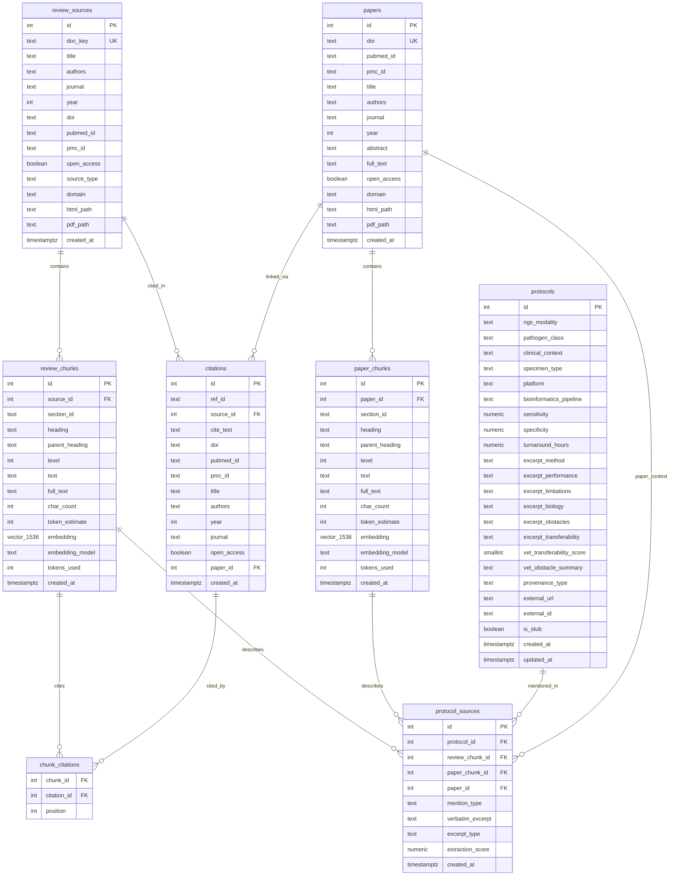
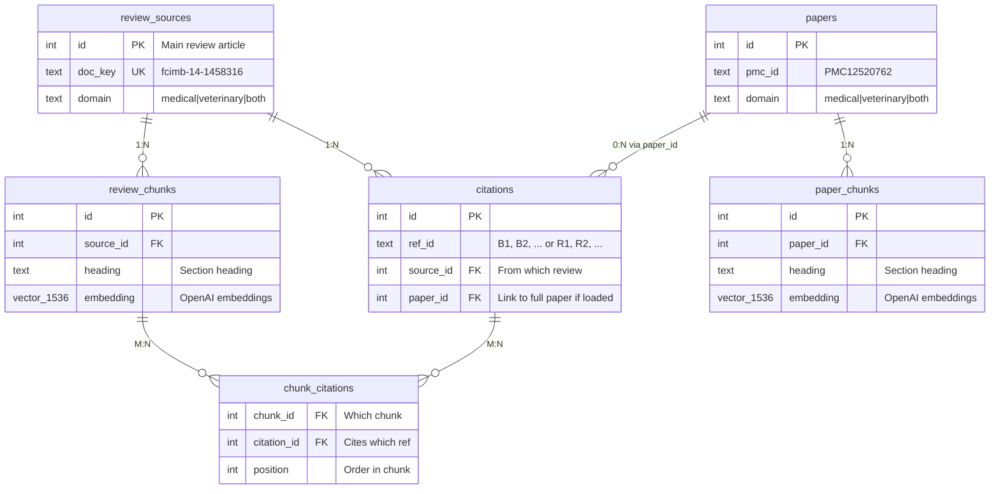
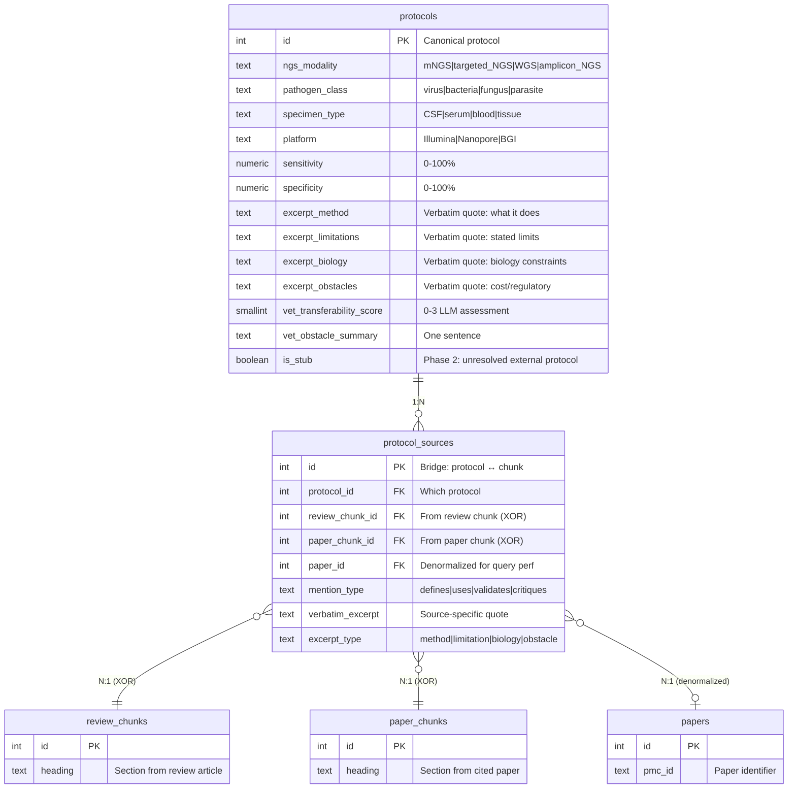
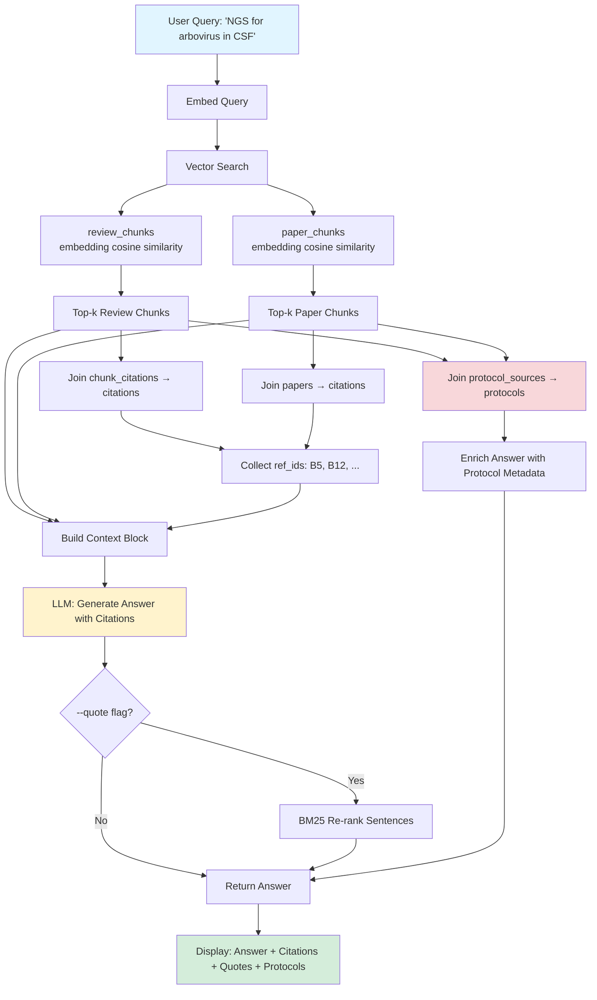
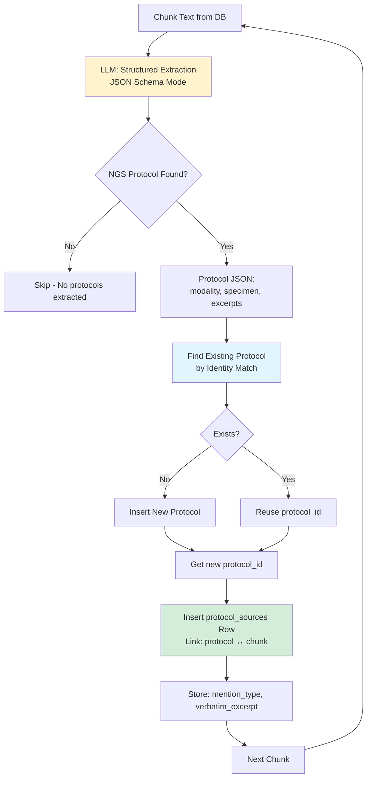
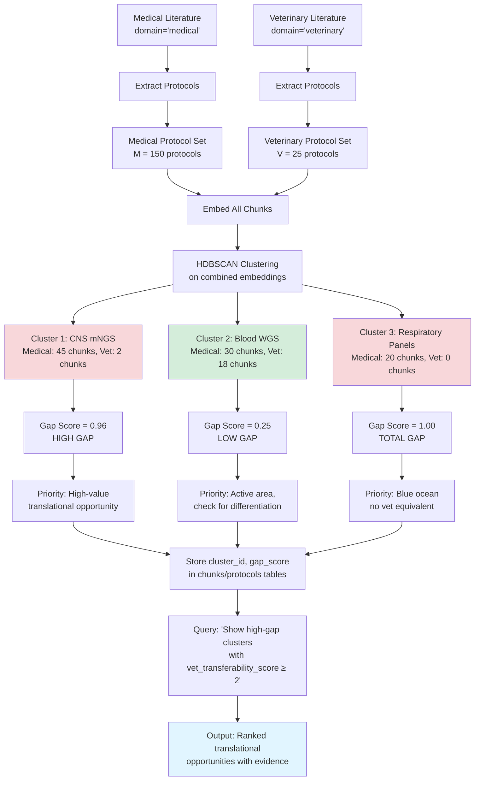
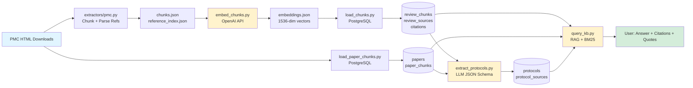
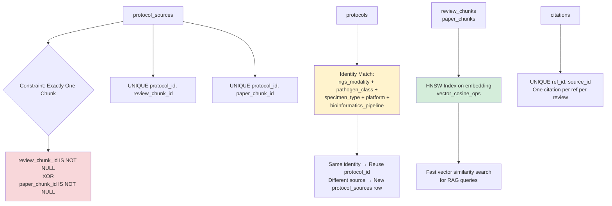

# Database Schema Diagrams

Visual representations of the `mngs_kb` database schema using Mermaid.

---

## Full Schema Overview

---

## Core Literature Tables (v1)

Focus on the original review article + cited papers structure:

---

## Protocol Extraction Tables (v2)

Focus on the new protocol knowledge synthesis layer:

---

## Query Flow: RAG + Protocol Context

How a user query flows through the system:

---

## Protocol Extraction Flow

How `extract_protocols.py` processes chunks:

---

## Domain Gap Analysis (Planned - Phase 2)

How veterinary corpus integration will enable gap scoring:

---

## Data Flow: From Download to Query

End-to-end pipeline:

---

## Key Constraints & Indexes

Important schema rules visualized:

---

**Generated:** 2026-02-19
**Database:** `mngs_kb` PostgreSQL schema v2
**Related:** `create_schema.sql`, `SESSION_CONTEXT.md`
